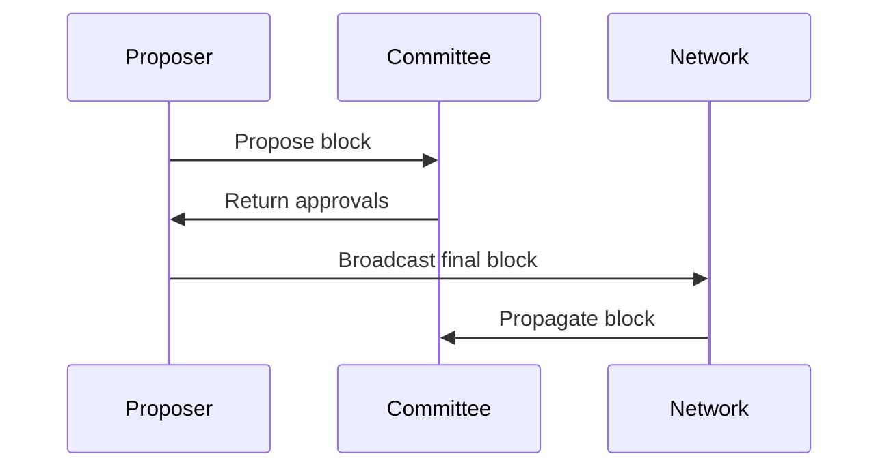

# Dyphira L1 Blockchain

A high-performance L1 blockchain implementation in Go featuring Delegated Proof of Stake (DPoS) consensus with a fixed committee size of 31 validators.

## Features

- **DPoS Consensus**: Fixed committee of 31 validators with round-robin block production
- **Binary Merkle Trie**: Efficient state management using modified Ethereum Patricia Trie
- **LevelDB Storage**: Persistent storage for blockchain data
- **LibP2P Networking**: Peer-to-peer communication using GossipSub
- **secp256k1 Cryptography**: ECDSA signatures and address derivation
- **CLI Interface**: Command-line tools for node management and interaction

## Architecture

### Core Components

1. **Consensus Engine** (`consensus/`): DPoS implementation with validator election and block approval
2. **Core Blockchain** (`core/`): Block and transaction processing, validation
3. **State Management** (`state/`): Binary Merkle Trie and LevelDB storage
4. **Cryptography** (`crypto/`): Key generation, signing, and address derivation
5. **Networking** (`network/`): P2P communication using LibP2P
6. **CLI** (`cmd/dyphira/`): Command-line interface

### Key Parameters

| Parameter          | Value       | Description                          |
|--------------------|-------------|--------------------------------------|
| Committee Size     | 31          | Fixed validator count per epoch      |
| Epoch Length       | 270 blocks  | Validator rotation interval          |
| Block Time         | 2 seconds   | Target block production interval     |
| Block Size Limit   | 256 MB      | Maximum block size                   |
| Finality Threshold | 21 (2/3+1)  | Required approvals per block         |
| Timeout            | 250 ms      | Block approval window                |
| Min Self Stake     | 10,000 DYP  | Minimum stake to become validator    |

## Installation

### Prerequisites

- Go 1.21 or later
- Git

### Build

```bash
# Clone the repository
git clone <repository-url>
cd dyphira-chain-v2

# Install dependencies
make deps

# Build the binary
make build

# Or build for specific platform
make build-linux
make build-darwin
make build-windows
```

## Usage

### Starting a Node

```bash
# Start a node on default port 8080
./bin/dyphira-node start

# Start with custom port and database path
./bin/dyphira-node start --port 8081 --db-path ./my-node.db
```

### Account Management

```bash
# Create a new account
./bin/dyphira-node create-account

# Check account balance
./bin/dyphira-node balance --address <address>

# Send a transaction
./bin/dyphira-node send --from <from-addr> --to <to-addr> --value <amount> --private-key <key>
```

### Blockchain Interaction

```bash
# Get block by height
./bin/dyphira-node block --height 1

# List all validators
./bin/dyphira-node validators

# Create genesis block
./bin/dyphira-node genesis
```

### P2P Networking

The node automatically:
- Joins the P2P network on startup
- Discovers and connects to peers
- Propagates blocks and transactions
- Participates in consensus messages

## Development

### Project Structure

```
dyphira-chain-v2/
├── consensus/       # DPoS consensus implementation
├── core/            # Blockchain core logic
├── state/           # State management and storage
├── crypto/          # Cryptographic operations
├── network/         # P2P networking
├── cmd/dyphira/     # CLI entrypoint
├── types/           # Core data structures
├── go.mod           # Go module file
├── Makefile         # Build automation
└── README.md        # This file
```

### Running Tests

```bash
make test
```

### Development Workflow

1. **Phase 1**: Core Implementation ✅
   - Cryptographic primitives
   - Merkle Trie state DB
   - Block/transaction structures
   - Basic networking layer

2. **Phase 2**: Consensus Engine ✅
   - Validator election
   - Block proposal logic
   - Approval collection system
   - Epoch transitions

3. **Phase 3**: Operational Features (In Progress)
   - Staking/delegation contracts
   - Slashing conditions
   - Monitoring/metrics system
   - Enhanced CLI tools

4. **Phase 4**: Optimization (Planned)
   - Parallel transaction processing
   - State pruning mechanisms
   - Network compression
   - Signature aggregation

## Consensus Protocol

### DPoS Overview

1. **Validator Election**: Every 270 blocks, validators are elected based on stake and reputation
2. **Block Production**: Round-robin assignment among committee members
3. **Approval Process**: Block finalizes upon receiving 21 validator signatures
4. **Epoch Transitions**: Automatic committee rotation at epoch boundaries

### Block Production Flow



## API Reference

### Transaction Format

```go
type Transaction struct {
    Nonce     uint64
    To        crypto.Address
    Value     *big.Int
    Fee       *big.Int
    Signature Signature
}
```

### Block Format

```go
type Block struct {
    Header       BlockHeader
    Transactions []Transaction
    ValidatorSig []byte      // Proposer signature
    Approvals    [][]byte    // 21 validator signatures
}
```

## Contributing

1. Fork the repository
2. Create a feature branch
3. Make your changes
4. Add tests for new functionality
5. Submit a pull request

## License

[Add your license here]

## Roadmap

- [ ] Smart contract support
- [ ] Cross-chain bridges
- [ ] Advanced staking mechanisms
- [ ] Governance system
- [ ] Mobile wallet SDK
- [ ] Enterprise features

## Support

For questions and support, please open an issue on GitHub or contact the development team. 